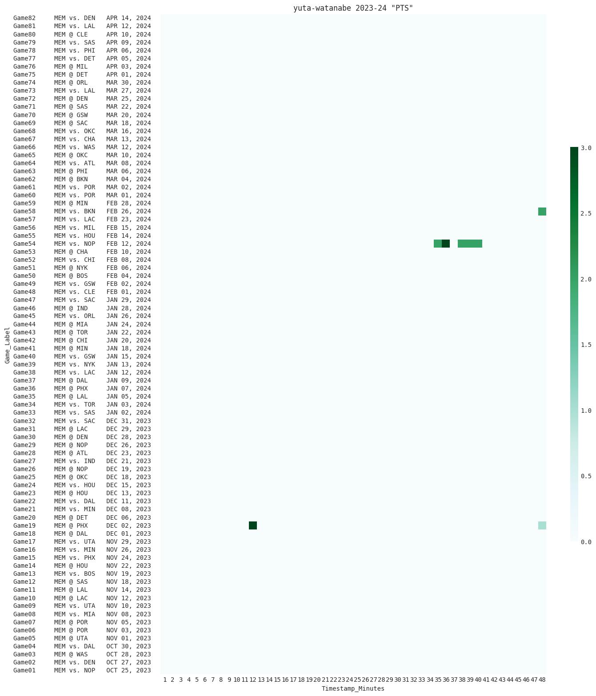

## 活躍状況 2023-24 シーズン
> Last Update: 2024-04-30 21:47:46
- (注)オーバータイム時の情報は対象外です。

### 渡邊雄太 Yuta Watanabe
- 出場時間帯 Minutes

- Before being traded to the Memphis.

- 得点 Score

- Before being traded to the Memphis.

### 八村塁 Rui Hachimura
- 出場時間帯 Minutes

- 得点 Score
